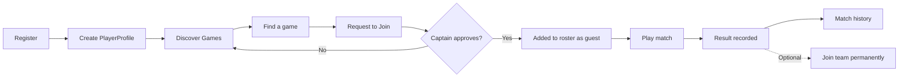
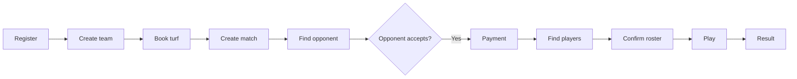
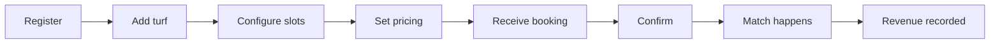
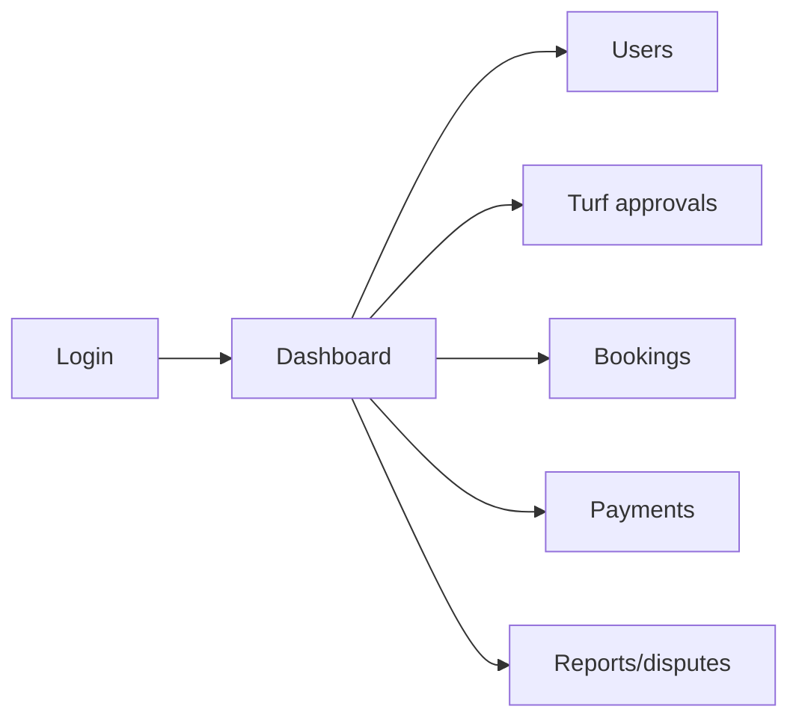
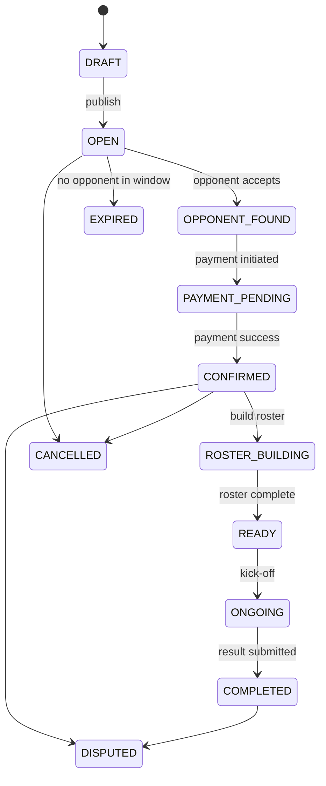
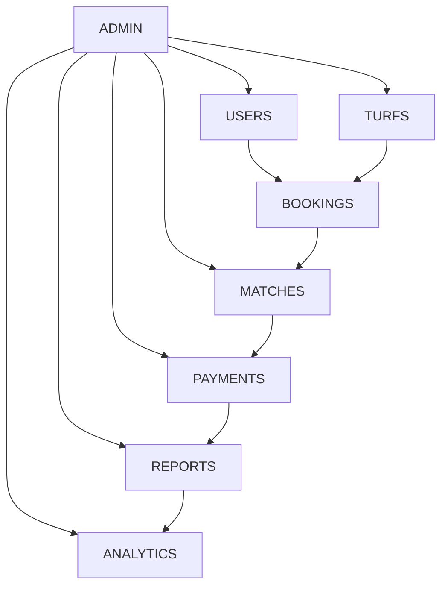
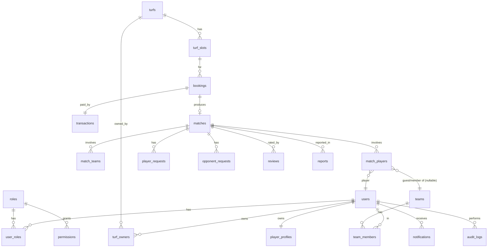
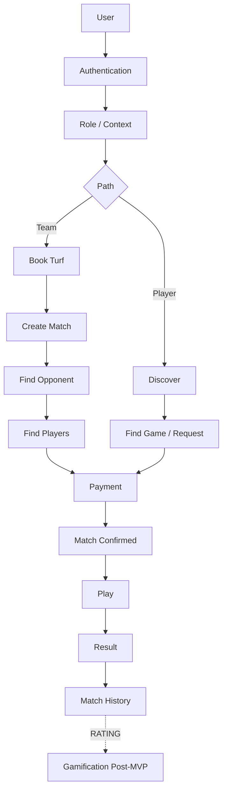
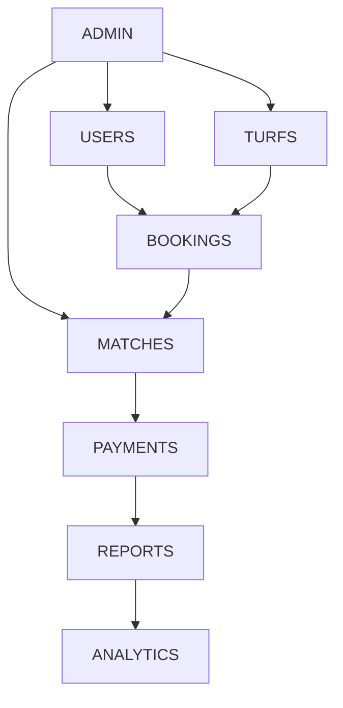

# Turfkoi — Project Requirements & Architecture Document

> **Single source of truth** for product, UX, frontend, backend, database, security, testing, and deployment decisions.
>
> Platform: **Football/Turf Booking + Team Matchmaking + Player Matchmaking + Turf Management**
> Stack: **Next.js (App Router) + TypeScript + Tailwind + shadcn/ui + PostgreSQL/PostGIS + Vercel**
> Market: **Bangladesh** (BDT, bKash/Nagad, BariKoi Maps)

---

## Table of Contents

0. [Document Status & Conventions](#0-document-status--conventions)
1. [Product Vision](#1-product-vision)
2. [Core Problem](#2-core-problem)
3. [Business Model](#3-business-model)
4. [Product Principle](#4-product-principle)
5. [User Roles](#5-user-roles)
6. [RBAC](#6-rbac)
7. [Information Architecture & Sitemap](#7-information-architecture--sitemap)
8. [User Journeys](#8-user-journeys)
9. [Mobile-First Requirement](#9-mobile-first-requirement)
10. [Responsive Breakpoint Strategy](#10-responsive-breakpoint-strategy)
11. [UI/UX Direction](#11-uiux-direction)
12. [Design System](#12-design-system)
13. [Typography](#13-typography)
14. [Component Architecture](#14-component-architecture)
15. [UI States](#15-ui-states)
16. [Mobile UX](#16-mobile-ux)
17. [Accessibility](#17-accessibility)
18. [Player Experience](#18-player-experience)
19. [Current Team](#19-current-team)
20. [Player Matchmaking](#20-player-matchmaking)
21. [Team Management](#21-team-management)
22. [Team vs Team Matchmaking](#22-team-vs-team-matchmaking)
23. [Match State Machine](#23-match-state-machine)
24. [Turf Management](#24-turf-management)
25. [Slot Management](#25-slot-management)
26. [Turf Owner Dashboard](#26-turf-owner-dashboard)
27. [Booking System](#27-booking-system)
28. [Booking Flow](#28-booking-flow)
29. [Payment Architecture](#29-payment-architecture)
30. [Payment Splitting](#30-payment-splitting)
31. [Notifications](#31-notifications)
32. [Location & Map](#32-location--map)
33. [Matchmaking Engine](#33-matchmaking-engine)
34. [Player Profile](#34-player-profile)
35. [Admin Panel](#35-admin-panel)
36. [Admin Oversight](#36-admin-oversight)
37. [Database Architecture](#37-database-architecture)
38. [Data Consistency](#38-data-consistency)
39. [Security](#39-security)
40. [Privacy](#40-privacy)
41. [API Architecture](#41-api-architecture)
42. [Next.js Architecture](#42-nextjs-architecture)
43. [Routing](#43-routing)
44. [Navigation](#44-navigation)
45. [Forms](#45-forms)
46. [Tables & Data-Heavy UI](#46-tables--data-heavy-ui)
47. [Performance](#47-performance)
48. [Caching](#48-caching)
49. [Realtime](#49-realtime)
50. [SEO](#50-seo)
51. [Analytics](#51-analytics)
52. [Error Handling](#52-error-handling)
53. [Browser Compatibility](#53-browser-compatibility)
54. [Testing](#54-testing)
55. [Development Environments](#55-development-environments)
56. [Deployment](#56-deployment)
57. [Vercel Limitations](#57-vercel-limitations)
58. [Environment Variables](#58-environment-variables)
59. [Audit Logging](#59-audit-logging)
60. [Acceptance Criteria (Per Feature Template)](#60-acceptance-criteria-per-feature-template)
61. [Business Rules](#61-business-rules)
62. [Edge-Case Checklist](#62-edge-case-checklist)
63. [Phase-by-Phase Development](#63-phase-by-phase-development)
64. [MVP Definition](#64-mvp-definition)
65. [Post-MVP / Future](#65-post-mvp--future)
66. [Pre-Development Checklist](#66-pre-development-checklist)
67. [Definition of Done](#67-definition-of-done)
68. [Final System Flow](#68-final-system-flow)
69. [Architecture Decisions (ADR Summary)](#69-architecture-decisions-adr-summary)

---

## 0. Document Status & Conventions

| Field | Value |
|---|---|
| Document version | 1.0 |
| Status | Draft — ready for implementation handoff |
| Owner | Product Architect |
| Audience | Devs, coding agents, PM, designer |
| Scope labels | **[MVP]** / **[Post-MVP]** / **[Future]** |

Conventions used throughout:

- **[MVP]** = required for first launch.
- **[Post-MVP]** = scoped but not in first launch.
- **[Future]** = explicitly out of current roadmap.
- Acceptance criteria use Given/When/Then.
- Mermaid diagrams are authoritative for flows and ERDs.

---

## 1. Product Vision

Turfkoi is **not** a turf booking website. It is a platform that connects four primary roles around the game of football:

1. **Turf Owners** — list turfs, manage slots, fill empty capacity.
2. **Teams / Team Owners** — book turfs, find opponents, fill rosters.
3. **Individual Players** — find nearby games, join as guest or member.
4. **Platform Admin** — governs the ecosystem.

> **Tagline:** *Book a turf. Find an opponent. Find missing players. Play.*

The differentiator vs. existing turf-booking sites in Bangladesh is **matchmaking** — we close the loop from "I want to play tonight" to "match confirmed."

---

## 2. Core Problem

### Team flow we solve

A team wants to play tonight. They should be able to: find a turf → check slots → book → find an opponent → find missing players → pay → confirm → play → record result → build history.

### Solo player flow we solve

A player without a team should: open app → find nearby games → see teams needing players → request to play → get accepted → play as guest → optionally join the team later.

### Turf owner flow we solve

A turf owner should: add turf → manage info → configure slots → receive bookings → get notifications → monitor revenue → manage availability/pricing → see upcoming matches → manage customers → promote empty slots.

---

## 3. Business Model

**Initial model: do NOT charge turf owners.** Turf owners list for free. Revenue comes from a **platform/booking service fee** charged to the booker.

### Fee mechanics

| Item | Example (BDT) |
|---|---|
| Turf price | ৳1,000 |
| Platform fee (~5%) | ৳50 |
| Customer pays | ৳1,050 |
| Turf owner receives | ৳1,000 |
| Platform receives | ৳50 |

Rules:

- Fee target ≈ **5%**, capped around **৳100** (final values TBD before launch).
- Fee is **transparent** — always shown before payment, never silently changed after payment.
- Fee is **stored on the transaction row** at payment creation time (immutable post-creation).
- Turf owners pay **zero commission** in MVP.

### Future monetization [Future]

Turf Pro subscription, Match Boost, Slot promotion, Tournament fees, Player Pro, Sponsorship, League fees, Marketplace commission, Coach marketplace, Referee marketplace. All explicitly out of MVP.

---

## 4. Product Principle

Every major screen must answer one question: **"What should the user do next?"**

| Role | Primary CTA |
|---|---|
| Player | **Find a Game** |
| Team | **Find Opponent** |
| Turf Owner | **Fill Empty Slot** |
| Admin | **Review Pending Items** |

Avoid dashboards that are only collections of statistics with no action.

---

## 5. User Roles

Use **one core identity: `User`**. Do not create separate auth accounts per role. A single person can simultaneously be: Player + Team Owner + Team Captain + Turf Owner.

Conceptual model:

```
User
 ├── Profile (name, phone, avatar)
 ├── PlayerProfile (position, skill, availability)
 ├── TeamMembership[] (team + role)
 ├── TeamOwnership[] (teams this user owns)
 ├── TurfOwnership[] (turfs this user owns)
 └── Roles[] / Permissions[] (RBAC capabilities)
```

### DB representation

- `users` — identity, auth, contact.
- `user_roles` — many-to-many join with `roles`.
- `team_members` — team membership + team role (owner/captain/manager/player).
- `turf_owners` — many-to-many; a turf can have multiple owners/staff [Post-MVP].
- `player_profiles` — 1:1 with user; nullable (created lazily when a user first acts as a player).

### Auth layer

Capabilities are computed at request time from `user_roles` + ownership relationships (team/turf). A user "can manage team X" iff they have a `team_members` row with role `owner`/`captain` for team X. A user "can manage turf Y" iff they have a `turf_owners` row for turf Y (or `ADMIN` role).

---

## 6. RBAC

### Role hierarchy

| Role | Scope | Capabilities |
|---|---|---|
| `ADMIN` | Platform-wide | Full management of all entities, payments, disputes, reports. |
| `TURF_OWNER` | Per-turf | Manage own turfs, slots, pricing, bookings, turf payments. |
| `TEAM_OWNER` / `CAPTAIN` | Per-team | Manage team, members, matches, player requests. |
| `PLAYER` | Self | Manage player profile, availability, requests, memberships. |

Future roles [Future]: `TEAM_MANAGER`, `TEAM_PLAYER` (distinct from captain), `TURF_STAFF`.

### Permission model

Use **capability-based** checks, not just role-name checks. Pseudocode:

```ts
can(user, 'team.update', teamId)  // owns/captains teamId OR admin
can(user, 'turf.update', turfId)  // owns turfId OR admin
can(user, 'booking.cancel', bookingId) // owns booking, or owns turf, or admin
```

### Enforcement layers

| Layer | Mechanism |
|---|---|
| DB | Row-level checks in service layer; unique constraints to prevent abuse. |
| API | Every route validates auth + resource ownership before mutation. |
| Frontend route | Route groups with middleware; redirect on unauthorized. |
| Frontend UI | Hide/disable actions the user can't perform (defense in depth, not sole control). |

---

## 7. Information Architecture & Sitemap

### Public (indexable)

```
/                         — Home / marketing
/turfs                    — Turf discovery
/turfs/[slug]             — Turf details (SEO target)
/teams/[slug]             — Team public profile (SEO target) [Post-MVP]
/matches/[slug]           — Match public page [Post-MVP]
/login, /register         — Auth
/faq, /legal/*, /about    — Static content
```

### Private (auth-gated, role-aware)

```
/app                      — Player dashboard
/team                     — Team dashboard (context: selected team)
/turf-owner               — Turf owner dashboard (context: selected turf)
/admin                    — Admin dashboard
```

### Role-specific navigation rationale

- **Player** home optimizes for "play tonight" — discovery-first.
- **Team** home optimizes for "next match" — matches/roster-first.
- **Turf owner** home optimizes for "fill slots + today's revenue".
- **Admin** home optimizes for "what needs review today".

### Sitemap diagram

```mermaid
graph TD
    Root[Turfkoi]
    Root --> Public[Public]
    Root --> Private[Private]
    Public --> Home[/]
    Public --> Turfs[/turfs, /turfs/slug]
    Public --> Teams[/teams/slug]
    Public --> Auth[/login, /register]
    Private --> App[/app Player]
    Private --> Team[/team]
    Private --> Owner[/turf-owner]
    Private --> Admin[/admin]
```

---

## 8. User Journeys

### Player journey [MVP]



### Team journey [MVP]



### Turf owner journey [MVP]



### Admin journey [MVP]



---

## 9. Mobile-First Requirement

**Mobile-first → Tablet → Laptop → Desktop → Large Desktop.** Do not shrink desktop layouts.

Reference widths to design/test against:

```
320, 375, 390, 414, 640, 768, 1024, 1280, 1440, 1536, ultrawide
```

Every major component must document its responsive behavior (see §10).

---

## 10. Responsive Breakpoint Strategy

Content-based breakpoints (Tailwind defaults; can be tuned):

| Range | Label |
|---|---|
| `< 640px` | Mobile |
| `640–1024px` | Tablet |
| `1024–1280px` | Laptop |
| `1280–1536px` | Desktop |
| `> 1536px` | Large desktop |

### Layout shift examples

Desktop:

```
[Sidebar] | [Main Content] | [Secondary Panel]
```

Mobile:

```
[Header]
[Main Content]
[Bottom Navigation]
```

### Per-component responsive rules

| Component | Mobile | Desktop |
|---|---|---|
| Navigation | Bottom nav + drawer | Persistent sidebar |
| Sidebar | Hidden (drawer) | Visible |
| Cards | Single column / horizontal scroll | Grid |
| Tables | Convert to card list | Table |
| Forms | Single column, sticky CTA | Multi-column where sensible |
| Dashboards | Stacked KPI cards | KPI row + charts |
| Maps | Full-width, tap-focused | Sidebar + map |
| Match cards | Vertical, swipeable | Grid |
| Booking flow | Step-by-step bottom sheet | Two-pane wizard |
| Modals | Bottom sheet | Centered dialog |
| Filters | Bottom sheet trigger | Inline sidebar |
| Notifications | Full-screen panel | Dropdown |
| Charts | Simplified, single series | Full multi-series |

---

## 11. UI/UX Direction

**Visual identity: sports-tech + gaming aesthetic — premium, energetic, competitive, dark-first.** Not childish.

### Starting palette (evaluate for contrast before freeze)

| Token | Hex |
|---|---|
| `bg` | `#080B10` |
| `card` | `#11161D` |
| `primary` | `#00E676` |
| `secondary` | `#7C5CFC` |
| `text` | `#FFFFFF` |
| `muted` | `#8B95A5` |
| `danger` | `#FF4D4F` |
| `warning` | `#FFC53D` |

### Motion

- Subtle micro-interactions: yes.
- Excessive animation: no.
- Payment/booking flows must remain **calm and trustworthy** — minimal motion.
- Respect `prefers-reduced-motion`.

### Visual language

Player cards, team badges, match cards, XP bars [Post-MVP], status indicators, achievement badges [Post-MVP], football/stadium imagery, match-center visuals.

---

## 12. Design System

### Tokens

- **Color**: see §11 + semantic tokens (`success`, `info`, `border`, `ring`, `input-bg`).
- **Spacing scale**: `4, 8, 12, 16, 24, 32, 48, 64` (px). No arbitrary spacing.
- **Border radius**: `4, 8, 12, 16, 9999` (full pill).
- **Shadows**: low/med/high for card / popover / modal.
- **Icons**: one library (lucide-react), consistent stroke width.

### Components inventory (shadcn/ui baseline + custom)

Global: `Button`, `Input`, `Select`, `Textarea`, `Checkbox`, `RadioGroup`, `Switch`, `Dialog`, `BottomSheet` (custom), `Sheet`, `Tabs`, `Table`, `Badge`, `Alert`, `Toast`, `Skeleton`, `Avatar`, `Tooltip`, `Dropdown`, `Popover`, `Pagination`, `EmptyState`, `LoadingState`, `ErrorState`, `StatusBadge`, `FilterBar`, `DateSelector`, `Map`, `SlotSelector`, `PaymentSummary`.

Feature-specific: `MatchCard`, `TurfCard`, `TeamCard`, `PlayerCard`, `BookingCard`, `TeamBadge`, `Rating`, `XPBar` [Post-MVP], `NotificationItem`, `RosterSlot`.

Avoid duplicate UI — if two features share a visual pattern, promote to global.

---

## 13. Typography

### Scale (desktop / mobile)

| Token | Desktop | Mobile |
|---|---|---|
| H1 | 40/48 | 28/36 |
| H2 | 32/40 | 24/32 |
| H3 | 24/32 | 20/28 |
| Body | 16/24 | 16/24 |
| Small | 14/20 | 14/20 |
| Caption | 12/16 | 12/16 |

### Font

- Latin: Inter (or Geist Sans). Weights: 400/500/600/700.
- Bengali: a fallback like Hind Siliguri / Noto Sans Bengali.
- Use `next/font` with `display: swap`. Provide fallbacks.
- Test long Bengali strings and English+Bangla mixed labels.

---

## 14. Component Architecture

Principles:

- **Server components by default.** Mark `"use client"` only when interactivity/state is required.
- **Feature folders** own their components; promote shared ones to global `components/`.
- Props are typed; no `any`.
- Compose small primitives; avoid mega-components.

Global vs feature:

| Tier | Location | Examples |
|---|---|---|
| Global UI | `src/components/ui` | Button, Input, Dialog |
| Global composite | `src/components/shared` | EmptyState, FilterBar |
| Feature | `src/features/<domain>/components` | MatchCard, TurfCard |

---

## 15. UI States

Every meaningful view must define: **Loading, Empty, Error, Success, Disabled, Partial data, Offline** (where relevant).

Example — Turf Owner Dashboard:

| State | Behavior |
|---|---|
| Loading | Skeleton cards for KPIs + bookings |
| Empty | "No bookings yet. Share your turf link to get your first booking." + CTA |
| Error | "Couldn't load dashboard. [Retry]" |
| Success | Live KPIs, today's bookings, fill-this-slot suggestions |
| Offline | Show last cached state with stale banner |

Never ship only the happy path.

---

## 16. Mobile UX

Mobile is a first-class experience, not a resize.

- Bottom navigation (role-aware).
- Bottom sheets for filters, slot selection, confirmations.
- Sticky CTAs (e.g., "Pay ৳1,050") at viewport bottom.
- Large touch targets (min 44×44).
- Horizontal-scroll card carousels for discovery.
- Mobile-friendly slot picker (vertical time list, not grid).
- Mobile payment flow with provider redirects.
- Full-screen notification center.
- Tables → card lists on mobile (not horizontal scroll).

---

## 17. Accessibility

Target: WCAG 2.1 AA.

- Semantic HTML (`nav`, `main`, `section`, `button` not `<div onClick>`).
- Keyboard navigation for every interactive element.
- Visible focus rings (never remove without replacement).
- ARIA only where semantics are insufficient.
- Color contrast ≥ 4.5:1 for text.
- Form errors linked via `aria-describedby`.
- Dialogs trap focus and restore on close.
- Touch targets ≥ 44×44 px.
- Never rely on color alone for status (always pair with icon/text).
- Respect `prefers-reduced-motion`.

---

## 18. Player Experience

Player homepage prioritizes **"PLAY TONIGHT."**

Sections:

1. **Find a Game** (primary CTA).
2. **Nearby Matches** (geo-sorted, time-filtered).
3. **My Team** card (current team, upcoming match).
4. **Upcoming Match** (if any).
5. **Teams Needing Players** (filtered to position/skill).
6. **Availability toggle** (e.g., "Available tonight").
7. **Notifications**.

---

## 19. Current Team

Every player must clearly see their current team context.

```
CURRENT TEAM
┌────────────────────────────┐
│ [logo] Eagles FC           │
│ Role: Captain              │
│ Next match: Tonight 8 PM   │
└────────────────────────────┘
```

Show: logo, name, player role, captain, members count, upcoming matches, recent results, team stats.

> **CRITICAL DISTINCTION (preserve across DB, API, permissions, UI):**
>
> - **Permanent team membership** — row in `team_members`.
> - **Guest player for a specific match** — row in `match_players` with `role = guest`, **no** `team_members` row.
>
> A guest appearance must **never** auto-promote to permanent membership. UI must label guests distinctly (e.g., "Guest · Tigers FC" badge).

---

## 20. Player Matchmaking

A player can:

1. Find nearby matches needing players.
2. Filter by distance, time, position, skill.
3. See teams needing players.
4. Request to join.
5. Wait for captain approval.
6. Receive notification.
7. On accept — become **guest player** for that match.

Example match card:

```
Eagles FC
Needs: 2 players
Position: ST / RW
Match: 8 PM
Distance: 1.8 km
[Request to Join]
```

Captain actions: Accept / Reject. On accept → `match_players` row with `role=guest` is created. Roster limit enforced by DB constraint.

---

## 21. Team Management

Capabilities: create team, edit profile (logo, name, location, skill level, match type), manage members (invite, remove, role change), set captain/manager, view match history, team rating [Post-MVP], stats.

### Team member roles

| Role | Capabilities |
|---|---|
| Owner | Everything; cannot be removed without ownership transfer. |
| Captain | Manage roster, matches, player requests, accept/reject opponents. |
| Manager [Post-MVP] | Manage logistics (bookings, payments). |
| Player | View team, mark availability. |

Guardrail: an owner cannot remove themselves while they are the only owner; require transfer first.

---

## 22. Team vs Team Matchmaking

Team A creates a match (after booking turf):

```
Eagles FC · Tonight 8 PM · Turf Arena · 5v5
Looking for: 1 opponent
```

Filters for opponent discovery: distance, skill, match type, date, time, turf, rating [Post-MVP].

When Team B accepts → state `OPPONENT_FOUND` → payment flow begins.

---

## 23. Match State Machine



Valid transitions are enforced server-side via a `match_state_transitions` table or enum check in the service layer. Invalid transitions return `409 CONFLICT` with a domain error code.

---

## 24. Turf Management

Turf owner can manage: name, description, photos, location + coordinates, turf type (5v5/7v7/11v11), indoor/outdoor, grass type, lighting, parking, changing room, shower, washroom, equipment, opening hours, rules, pricing.

Multiple turfs per owner are supported.

---

## 25. Slot Management

Slot = turf × date × time window (e.g., 1 hour). Owner manages: availability, pricing, peak pricing, holiday pricing, maintenance, blocked slots.

Example:

```
5 PM → Available
6 PM → Booked
7 PM → Booked
8 PM → Available
9 PM → Maintenance
```

Actions: block/unblock, change price, mark maintenance.

Slots can be **generated** from a turf's availability template for a date range (job), then individually overridden.

---

## 26. Turf Owner Dashboard

KPIs: today's revenue, today's bookings, upcoming bookings, available slots, occupancy %, revenue analytics, payment history, customer history, notifications.

**Key product feature:** **"Fill This Slot."**

```
Tonight 8–9 PM · EMPTY
Potential revenue: ৳1,200
[Find Teams] [Promote Slot]
```

This is the single most important turf-owner-facing feature — it communicates platform value (we fill your empty slots).

---

## 27. Booking System

### Lifecycle

```
AVAILABLE → HELD → PAYMENT_PENDING → CONFIRMED
                              ↘ PAYMENT_FAILED
HELD → EXPIRED (TTL)
CONFIRMED → CANCELLED → REFUNDED
CONFIRMED → COMPLETED
```

### Concurrency guarantees

- **Double booking prevented at DB level.** Unique constraint on `(turf_id, date, slot_start)` for active bookings, or use `SELECT ... FOR UPDATE` in a transaction.
- **Held slots expire** (e.g., 10 min) via a TTL job or expiry-on-read check.
- **Idempotency keys** on booking creation and payment initiation prevent duplicates from retries.
- Booking creation + slot reservation happens in a single transaction.

---

## 28. Booking Flow

```
Discover Turf → Turf Details → Select Date → Select Slot
→ Booking Summary (with fee breakdown) → Payment → Confirmed
→ Notifications dispatched
```

Fee breakdown example:

```
Turf price       ৳1,000
Platform fee        ৳50
────────────────────────
Total            ৳1,050
```

All fees transparent, displayed before payment, immutable once payment is initiated.

---

## 29. Payment Architecture

**Provider is abstracted** behind a `PaymentProvider` interface. MVP targets bKash + Nagad + a card/PG fallback. Never couple business logic to one provider.

### Payment states

```
CREATED → PENDING → SUCCESS | FAILED
                  → CANCELLED
SUCCESS → REFUNDED | PARTIALLY_REFUNDED
```

### Transaction model

```
transactions
  id
  booking_id (FK)
  payer_id (FK users)
  receiver_id (FK users, nullable → turf owner)
  amount (decimal)
  currency (BDT)
  platform_fee (decimal, immutable after creation)
  provider (enum)
  provider_reference
  status (enum)
  idempotency_key (unique)
  created_at, updated_at
```

### Webhooks

- Verify signature.
- Idempotent (dedupe by `provider_reference` + event id).
- Handle out-of-order / delayed webhooks.
- Reconciliation job cross-checks provider settlement reports.

### Refunds

- Initiated only by admin or system policy (cancellation rules).
- Refund row references original transaction.
- Partial refunds supported.

---

## 30. Payment Splitting

MVP supports two scenarios:

1. **Team A pays full** — single payer, single transaction.
2. **Team A + Team B split** — two `transactions` rows linked to same booking; booking confirms only when both succeed.

Guest player contribution [Post-MVP] — keep schema extensible but don't build complex splitting in MVP.

**Rule:** booking state advances to `CONFIRMED` only when **all** required transactions reach `SUCCESS`.

---

## 31. Notifications

Centralized system. Channels: in-app (MVP), push [Post-MVP via FCM], email [Post-MVP for receipts/critical only].

### Notification types by audience

| Audience | Types |
|---|---|
| Turf Owner | booking_received, payment_received, cancellation, reminder, new_customer |
| Team | opponent_request, opponent_accepted, payment_required, payment_success, player_request, player_accepted, player_cancelled, match_reminder |
| Player | team_needs_player, request_accepted, request_rejected, match_reminder, match_cancelled, payment_confirmation |

Priority levels: `info`, `transactional`, `critical`. Push only for transactional+critical.

---

## 32. Location & Map

- Stack: PostgreSQL + **PostGIS** + **MapLibre** + **BariKoi** tiles/geocoding.
- Queries: `ST_DWithin`, `ST_Distance`, GiST indexes on coordinates.
- Distance filters: 1 / 3 / 5 / 10 km.

### Privacy

- **Players:** never expose exact home coordinates. Store approximate (rounded) coordinates or neighborhood; show only "1.8 km away."
- **Turfs:** exact coordinates are public (users navigate there).
- **Teams:** public location is the team's home turf or neighborhood, not a member's home.

---

## 33. Matchmaking Engine

**MVP is rule-based**, not AI.

Match by: distance, date, time, availability, skill level, match type, position need, team need.

Score candidates with a simple weighted formula (tunable in config), return top N. Architecture should isolate the scoring function so AI/models can replace it later [Future].

---

## 34. Player Profile

MVP fields: name, photo, primary position, secondary position, preferred foot, skill level (self-rated), approximate location, availability (next 7 days), matches played, match history.

Future [Future]: goals, assists, rating, XP, levels, achievements, leaderboards.

---

## 35. Admin Panel

Admins manage: users (search/filter/view/verify/suspend/ban), turfs (approve/reject/verify/suspend), teams, players, matches (view/cancel/investigate/dispute), bookings, payments (transactions/revenue/refunds/payouts/failed), reports & disputes, promotions [Post-MVP].

---

## 36. Admin Oversight



Admin permissions are **separate from user-scoped permissions** — they bypass resource-ownership checks (but are themselves heavily audited).

---

## 37. Database Architecture

PostgreSQL + PostGIS. Normalized. ERD below.



### Core tables (summary)

| Table | Purpose | Key fields / constraints |
|---|---|---|
| `users` | Identity/auth | id, phone (unique), email (nullable unique), password_hash, status |
| `user_roles` | M:N user→role | (user_id, role) PK |
| `player_profiles` | Player data | user_id PK/FK, position, skill, approx coords |
| `teams` | Team entity | id, slug (unique), owner_id FK |
| `team_members` | Membership | (team_id, user_id) PK, role, joined_at |
| `turfs` | Turf entity | id, slug, owner_id FK, coords ( PostGIS geography(Point,4326)) |
| `turf_owners` | M:N | (turf_id, user_id) PK |
| `turf_slots` | Availability | (turf_id, date, start_time) PK-ish, status, price; unique partial index on active slot |
| `bookings` | Booking | id, turf_id, slot ref, booker_id, status; **unique(turf_id, date, start_time) where status in active** |
| `transactions` | Payment | id, booking_id FK, amount, platform_fee, provider, idempotency_key (unique) |
| `matches` | Match | id, booking_id FK, state (enum), match_type |
| `match_teams` | Side | (match_id, team_id, side) |
| `match_players` | Roster | (match_id, user_id, role=member\|guest) |
| `player_requests` | Join requests | (match_id, user_id, status) |
| `opponent_requests` | Team invites | (match_id, team_id, status) |
| `notifications` | In-app | user_id, type, payload, read_at |
| `reviews` | Post-match | (match_id, reviewer_id, reviewee_id, rating) |
| `reports` | Disputes | reporter_id, entity, reason, status |
| `audit_logs` | Admin actions | actor_id, action, resource, before, after, at |

### Indexes

- GiST on `turfs.coords`, `player_profiles.coords`.
- B-tree on common filters: bookings by turf+date, matches by state, transactions by status.
- Composite on `turf_slots(turf_id, date)`.

### Constraints to enforce in DB

- Unique active booking per (turf, slot).
- Roster size ≤ match_type limit (trigger or app-level + check).
- One `team_members` row per (team, user).
- `platform_fee` immutable post-transaction-creation (trigger blocks update).
- Player request uniqueness per (match, user) while pending.

---

## 38. Data Consistency

| Concern | Mechanism |
|---|---|
| Double booking | Unique partial index + transaction with row lock on slot. |
| Concurrent booking | `SELECT ... FOR UPDATE` on the slot row inside the booking transaction. |
| Duplicate team membership | Unique (team_id, user_id). |
| Duplicate player request | Unique (match_id, user_id) where status=pending. |
| Duplicate opponent acceptance | Atomic `UPDATE ... WHERE status='OPEN'` (row affected = 0 → already taken). |
| Webhook duplication | Idempotency on (provider, provider_reference, event_id). |
| Roster overfill | Check count in same transaction as insert; trigger as backstop. |
| Deleted user | Soft-delete (`users.status=deleted`); preserve match history; anonymize PII. |
| Deleted team | Soft-delete; mark matches historical; release slot only per policy. |
| Suspended turf | Block new bookings; keep existing confirmed. |
| Cancelled booking | State machine; trigger refund flow if policy applies. |
| Refund state | Refund row + status enum; reconciliation job. |

---

## 39. Security

- **Auth:** session-based (JWT in httpOnly secure cookies) or NextAuth( Auth.js); password hashing via bcrypt/argon2.
- **Authz:** capability checks per request (see §6).
- **API validation:** zod at every boundary.
- **Rate limiting:** per-IP and per-user (esp. auth, payment, request endpoints).
- **CSRF:** SameSite=Strict cookies + token for cookie-based auth.
- **Secrets:** env vars only; never in client bundle; `NEXT_PUBLIC_` only for truly public values.
- **File uploads:** type/size validation, virus scan [Post-MVP], stored in private bucket, served via signed URLs.
- **Webhook verification:** signature check + idempotency.
- **Audit logs:** every admin/sensitive mutation.
- **Never expose:** DB credentials, payment secrets, private keys, exact player location, raw PII in logs.

---

## 40. Privacy

| Field | Visibility |
|---|---|
| Player exact coords | Private — never exposed; show distance only. |
| Phone / email | Private — shared only on confirmed match (and only with counterparty). |
| Payment info | Private — last 4 / masked only. |
| Team private roster notes | Members only. |
| Turf coordinates | Public. |

Support: account deletion (soft → hard after grace period), data export [Post-MVP], retention policy documented.

---

## 41. API Architecture

### Conventions

- Auth: cookie session (preferred) or bearer for mobile API [Post-MVP].
- Request/response: JSON.
- Validation: zod, errors as 422 with field-level messages.
- Pagination: cursor-based for feeds (`?cursor=`), offset for admin tables.
- Filtering/sorting: explicit query params, whitelist of allowed fields.
- Rate limit headers: `X-RateLimit-*`.

### Standard error shape

```json
{
  "success": false,
  "error": {
    "code": "BOOKING_UNAVAILABLE",
    "message": "This slot is no longer available.",
    "fields": { "slot_id": "already booked" }
  }
}
```

### Domain boundaries

```
/auth /users /players /teams /turfs /slots /bookings
/matches /matchmaking /payments /notifications /admin
```

---

## 42. Next.js Architecture

Stack: **Next.js (App Router) + TypeScript + Tailwind + shadcn/ui + Framer Motion + TanStack Query + Zustand (minimal).**

### Structure

```
src/
├── app/                    # routes (server components by default)
│   ├── (public)/
│   ├── (app)/              # player area
│   ├── (team)/
│   ├── (turf-owner)/
│   ├── (admin)/
│   └── api/
├── components/
│   ├── ui/                 # shadcn primitives
│   └── shared/             # cross-feature composites
├── features/               # domain modules (team, turf, booking, ...)
│   └── <domain>/
│       ├── components/
│       ├── actions.ts      # server actions
│       ├── api.ts          # client hooks (TanStack Query)
│       ├── schemas.ts      # zod
│       └── types.ts
├── lib/                    # db, auth, payment provider, map utils
├── hooks/
├── services/               # cross-cutting (email, push, storage)
├── types/
├── utils/
└── config/
```

### Directives

- Server components by default.
- `"use client"` only for interactivity.
- **Server Actions** for mutations where possible (less boilerplate than route handlers).
- `loading.tsx`, `error.tsx`, `not-found.tsx` per route segment.
- `metadata` per route for SEO.

---

## 43. Routing

See §7 for full list. Key rules:

- Public routes: indexable, SSR/ISR.
- Private routes: middleware-redirect to `/login` if unauthenticated.
- Role routes: redirect to user's default dashboard if they lack the role.
- `(group)` folders for layout grouping without URL impact.

---

## 44. Navigation

| Player | Team | Turf Owner | Admin |
|---|---|---|---|
| Home | Overview | Overview | Overview |
| Discover | Matches | Bookings | Users |
| Matches | Find Opponent | Turf | Turfs |
| My Team | Find Players | Slots | Teams |
| Profile | Team | Payments | Players |
|  | Payments | Customers | Matches |
|  |  | Analytics | Bookings |
|  |  |  | Payments |
|  |  |  | Reports |
|  |  |  | Promotions |
|  |  |  | Settings |

Mobile: bottom nav with max 5 items + "More" sheet; desktop: persistent sidebar.

---

## 45. Forms

Every form specifies: fields (required/optional, types, limits), validation rules, error messages, states (initial/loading/error/success/disabled), unsaved-changes guard, mobile keyboard type, file-upload rules (type/size/dimensions).

---

## 46. Tables & Data-Heavy UI

Capabilities: pagination, sorting, filtering, search, column visibility, bulk actions [where needed], CSV export [admin only].

Responsive: mobile converts to card list or expandable rows; never horizontal-scroll a 10-column table.

---

## 47. Performance

| Target | Goal |
|---|---|
| LCP | < 2.5s on 4G |
| INP | < 200ms |
| CLS | < 0.1 |
| JS bundle (initial) | < 200 KB gz |

Techniques: `next/image`, route segment config (`revalidate`), code splitting via dynamic imports, lazy-load map/heavy charts, cursor pagination, server components to reduce client JS, spatial indexes for geo queries, prefetch on likely-next links.

---

## 48. Caching

| Data | Strategy |
|---|---|
| Turf public info | ISR / long revalidate (e.g., 60s). |
| Turf list / discovery | Short revalidate (e.g., 10–30s). |
| Slot availability | **Do not blindly cache** — fetch fresh; cache only within a request. |
| Booking/payment state | Never cached. |
| User session | In-memory / cookie. |
| Map tiles | Provider-cached. |

Tag-based revalidation (`revalidateTag`) on turf updates.

---

## 49. Realtime

Use cases: booking confirmation push, opponent acceptance, player request outcome, payment status, notifications.

**Vercel serverless doesn't fit long-lived WebSockets.** Recommendation: use an external realtime provider — **Pusher, Ably, or Supabase Realtime** — triggered by DB/webhook events. Avoid polling where possible, but polling at 15–30s is an acceptable MVP fallback for non-critical views.

Keep realtime minimal — only subscribe where the user is actively waiting.

---

## 50. SEO

Public pages (`/turfs/[slug]`, `/teams/[slug]`, `/matches/[slug]`):

- Per-route `metadata` (title, description, OG, canonical).
- `sitemap.xml` + `robots.txt`.
- JSON-LD structured data (SportsActivityLocation for turfs).
- Semantic HTML, single H1, descriptive alt text.
- SEO-friendly slugs.
- Private dashboards: `noindex`.

---

## 51. Analytics

Core events:

| Event | Trigger | Role |
|---|---|---|
| `signup` | register success | any |
| `login` | login success | any |
| `turf_view` | turf detail open | any |
| `slot_view` | slot list viewed | player/team |
| `booking_started` | reach booking summary | player/team |
| `payment_started` | pay click | player/team |
| `payment_success` | webhook success | player/team |
| `match_created` | match publish | team |
| `opponent_request` | send | team |
| `opponent_accepted` | accept | team |
| `player_request` | request to join | player |
| `player_accepted` | accept | team |
| `match_completed` | result submit | team |

Each event carries role, role context (team/turf id where relevant), and non-PII metadata. Provider: Plausible or PostHog (privacy-friendly preferred).

---

## 52. Error Handling

Frontend: loading / empty / error / retry / success / offline states per view.

Backend:

- Consistent HTTP codes (200/201/204/400/401/403/404/409/422/429/500).
- Domain error codes (e.g., `BOOKING_UNAVAILABLE`, `ROSTER_FULL`).
- Structured server logs (no PII, no stack traces in response).
- Global error handler normalizes unexpected errors to a safe 500.

---

## 53. Browser Compatibility

Supported: Chrome, Safari, Firefox, Edge (latest 2 versions), iOS Safari, Android Chrome.

**iOS Safari special attention:** viewport units (`100dvh`), sticky positioning, bottom-sheet behavior, keyboard overlap, file uploads, payment redirects, map rendering. Test on real iOS devices before each release.

---

## 54. Testing

### Unit

Pricing/fee calc, match state transitions, permission predicates, zod schemas, slot generation.

### Integration

Booking lifecycle (happy + race), payment webhook (success/fail/dup/delayed), matchmaking scoring, player request accept/reject, team member CRUD.

### E2E (Playwright)

Full journey: register → create team → book turf → find opponent → opponent accepts → pay → find player → player accepts → play → complete. Plus edge cases below.

### Edge-case coverage

- Two users book same slot → exactly one succeeds.
- Payment succeeds but client disconnects → reconcile via webhook.
- Duplicate webhook → no double confirmation.
- Two teams accept same opponent request → exactly one wins.
- Player request after roster full → rejected with clear error.
- Match cancel → refund flow.
- Turf/user suspension → graceful UX.

---

## 55. Development Environments

```
Local → Preview/Staging (per-PR deploy) → Production
```

- **Branch strategy:** `main` (production), feature branches → PR → preview deploy → merge.
- **Migrations:** versioned, reviewed in PRs, run via CI; never manual on prod.
- **Seed data:** dev/staging only; never seed prod with fake PII.
- **Rollback:** one-click re-deploy of previous commit; DB migrations must be reversible.

---

## 56. Deployment

| Component | Provider |
|---|---|
| App | Vercel |
| DB | Managed PostgreSQL **with PostGIS** (Neon / Supabase / RDS — verify PostGIS support before commit) |
| Storage | S3-compatible (Cloudflare R2 / S3) |
| Realtime | Pusher / Ably / Supabase Realtime |
| Email [Post-MVP] | Resend / SES |
| Push [Post-MVP] | FCM |
| Error tracking | Sentry |
| Monitoring | Vercel Analytics + provider dashboards |
| Backups | Managed by DB provider + cross-region copy |

---

## 57. Vercel Limitations

| Concern | Handling |
|---|---|
| Serverless execution timeout | Keep request handlers fast; offload to background jobs. |
| Long-running jobs | Use a queue/worker (e.g., Inngest, QStash) — **don't** run inside serverless. |
| Cron | Vercel Cron for light tasks (slot expiry reminders); heavy work → external worker. |
| WebSockets | Not supported long-lived → use external realtime provider. |
| DB connection pooling | Use pooled connection string (PgBouncer via Neon/Supabase). |
| File uploads | Direct-to-storage presigned URLs; never through serverless body. |
| Background jobs | External (Inngest/QStash/Trigger.dev). |

---

## 58. Environment Variables

```env
# Public (safe to expose)
NEXT_PUBLIC_MAP_TILES_URL=
NEXT_PUBLIC_MAP_API_KEY=        # BariKoi public key
NEXT_PUBLIC_ANALYTICS_KEY=
NEXT_PUBLIC_REALTIME_KEY=

# Server-only (REQUIRED)
DATABASE_URL=                   # pooled
DATABASE_DIRECT_URL=            # for migrations (non-pooled)
AUTH_SECRET=
RESEND_API_KEY=

# Payment (server-only)
PAYMENT_BKASH_KEY=
PAYMENT_BKASH_SECRET=
PAYMENT_NAGAD_KEY=
PAYMENT_NAGAD_SECRET=

# Storage (server-only)
STORAGE_ACCESS_KEY=
STORAGE_SECRET_KEY=
STORAGE_BUCKET=
STORAGE_ENDPOINT=

# Realtime (server-only)
REALTIME_APP_ID=
REALTIME_SECRET=

# Push [Post-MVP]
FIREBASE_PROJECT_ID=
FIREBASE_CLIENT_EMAIL=
FIREBASE_PRIVATE_KEY=
```

Never commit real secrets. CI fails if `NEXT_PUBLIC_` prefix is on a secret value.

---

## 59. Audit Logging

Audit every sensitive mutation. Schema:

```
audit_logs
  id, actor_id, action, resource_type, resource_id,
  before (jsonb), after (jsonb), ip, user_agent, created_at
```

Examples: admin_suspend_user, turf_pricing_changed, booking_cancelled, refund_processed, team_member_removed. Retain per policy (e.g., 1 year).

---

## 60. Acceptance Criteria (Per Feature Template)

For every major feature, document these 17 items:

1. Purpose
2. Users
3. User flow
4. UI requirements
5. Responsive requirements
6. Backend requirements
7. Database requirements
8. API requirements
9. Permissions
10. Loading state
11. Empty state
12. Error state
13. Success state
14. Edge cases
15. Security considerations
16. Analytics events
17. Acceptance criteria (Given/When/Then)

### Sample — Slot booking

```
GIVEN a slot is already CONFIRMED,
WHEN another user attempts to book it,
THEN the booking must fail with error code BOOKING_UNAVAILABLE
AND the user must see a clear "Slot no longer available" message
AND no payment is initiated.
```

```
GIVEN two users start booking the same AVAILABLE slot concurrently,
WHEN both submit within the same hold window,
THEN exactly one transaction succeeds; the other receives BOOKING_UNAVAILABLE.
```

---

## 61. Business Rules

- **Booking:** cannot book unavailable slot; cannot double book; payment required for CONFIRMED.
- **Team:** owner controls team; captain/manager scoped permissions; player can leave; owner cannot remove self without transferring ownership.
- **Guest player:** match-specific; never auto-promotes to permanent member.
- **Match:** requires valid booking; cannot confirm without required payment; roster ≤ match_type limit.
- **Platform fee:** calculated at booking creation, displayed before payment, stored immutable on transaction.

---

## 62. Edge-Case Checklist

| Scenario | Behavior |
|---|---|
| No turfs nearby | Empty state + expand radius CTA |
| No teams/players nearby | Empty state + "create a team / host a game" CTA |
| No available slots | Show next-available date |
| No opponent found | Offer "play as open practice" or boost [Post-MVP] |
| No player found | Allow match to proceed short-handed or cancel |
| Booking expires | Slot reverts to AVAILABLE; notify user |
| Payment timeout | Mark PAYMENT_FAILED; release hold; allow retry |
| Payment success but redirect fails | Webhook confirms; UI reconciles on next load |
| Duplicate webhook | Idempotent — no double effect |
| Delayed webhook | Reconcile on read |
| Browser closed during payment | Webhook + reconciliation handles final state |
| Turf owner changes price mid-booking | Existing booking honored at creation price |
| Turf becomes unavailable / suspended | Existing confirmed honored; new bookings blocked |
| Team deleted | Soft-delete; matches historical; future matches cancelled |
| Player leaves team | Future match participations as member cancelled; guest stays |
| Player joins another team | Allowed; multiple memberships OK |
| Guest player cancels | Slot frees; team can re-request |
| Roster full | New requests auto-rejected with ROSTER_FULL |
| Match cancelled | Refund per policy; notify all parties |
| Match disputed | Enter DISPUTED; admin resolves |
| Refund requested | Admin/system initiates; status tracked |
| Duplicate requests | DB unique constraint blocks |
| Concurrent requests | Atomic conditional UPDATE resolves |
| Expired invitation | Mark EXPIRED; allow resend |
| Suspended user | Block mutations; allow read of historical data |
| Network failure / slow / offline | Show cached + retry; never silent failure |

---

## 63. Phase-by-Phase Development

| Phase | Scope |
|---|---|
| **0. Foundation** | This doc, ERD, design tokens, tech decisions, security model. |
| **1. Project setup** | Next.js + TS + Tailwind + shadcn + lint/format + CI + base layout + env. |
| **2. Auth & users** | Register, login, logout, profile, roles, RBAC, protected routes. |
| **3. Turf management** | Turf CRUD, facilities, photos, location (PostGIS), slots, availability, pricing, owner dashboard. |
| **4. Booking & payments** | Turf discovery, slot selection, booking, fee, payment (bKash/Nagad), confirmation, notifications, cancellation/refund. |
| **5. Team management** | Team CRUD, members, invitations, roles, team dashboard. |
| **6. Team matchmaking** | Create match, find opponent, accept/reject, payment, confirmation. |
| **7. Player matchmaking** | Availability, "need player", nearby matches, requests, approval, guest roster. |
| **8. Admin** | Users, turfs, teams, players, matches, bookings, payments, reports, disputes. |
| **9. Gamification** [Post-MVP] | Ratings, history, XP, levels, achievements. |
| **10. Growth** [Future] | Boost, Turf Pro, tournaments, sponsorship, marketplace. |
| **11. Production hardening** | Security audit, perf pass, a11y audit, SEO, test coverage, monitoring, backups, DR. |

---

## 64. MVP Definition

**MUST ship in MVP:**

- **Auth/users:** register, login, profile, roles.
- **Turf:** listing, details, availability, slots, booking, owner dashboard.
- **Team:** creation, members, dashboard.
- **Match:** create, find opponent, accept.
- **Player:** profile, current team, find game, request to join, guest play.
- **Payment:** platform fee, transaction, confirmation.
- **Notifications:** booking, match, player request, payment.
- **Admin:** users, turfs, teams, matches, bookings, payments.

---

## 65. Post-MVP / Future

**Post-MVP:** XP, achievements, advanced stats, leaderboards, tournaments, leagues, marketplace, Player Pro, Turf Pro, sponsorship, AI matchmaking, coach/referee marketplace, advanced analytics.

**Future:** considered exploratory, not committed.

---

## 66. Pre-Development Checklist

### Product
- [x] Business requirements understood
- [x] User roles defined
- [x] MVP scope frozen
- [x] User journeys documented
- [x] Edge cases documented

### UX
- [x] Sitemap completed
- [x] Navigation defined
- [x] Mobile-first layouts defined
- [x] Responsive breakpoints defined
- [x] Design tokens defined
- [x] Empty/Loading/Error/Success states defined

### Technical
- [x] Architecture selected (Next.js App Router)
- [x] ERD reviewed
- [x] API conventions defined
- [x] RBAC defined
- [x] Payment architecture defined
- [x] Realtime architecture defined (external provider)
- [x] Storage architecture defined

### Security
- [x] Auth strategy (session/JWT)
- [x] Authz strategy (capability-based)
- [x] Secret management
- [x] Payment security (webhook verify + idempotency)
- [x] File upload security
- [x] Rate limiting
- [x] Audit logging

### Deployment
- [x] Vercel architecture validated
- [ ] PostgreSQL provider selected (verify PostGIS) ← pending decision
- [ ] PostGIS verified on chosen provider ← pending decision
- [x] Storage provider selected (R2/S3)
- [x] Env strategy defined
- [x] CI/CD defined
- [x] Monitoring defined (Sentry + Vercel Analytics)
- [x] Backup strategy defined

---

## 67. Definition of Done

A feature is complete only when ALL of:

- [ ] Works on desktop, tablet, mobile
- [ ] Loading state exists
- [ ] Empty state exists
- [ ] Error state exists
- [ ] Success state exists
- [ ] Validation exists
- [ ] Permissions enforced (server + client)
- [ ] API errors handled
- [ ] DB constraints exist
- [ ] Accessibility considered (a11y checklist)
- [ ] Analytics implemented
- [ ] Tests exist (unit + integration; E2E for critical)
- [ ] Security reviewed
- [ ] Performance reviewed

---

## 68. Final System Flow



Admin oversight:



---

## 69. Architecture Decisions (ADR Summary)

| # | Decision | Rationale |
|---|---|---|
| ADR-01 | **Single `User` with multiple roles** | One person is often player + team owner + turf owner; separate auth would fragment identity. |
| ADR-02 | **Guest ≠ Member** (separate `match_players` from `team_members`) | Preserves the product intent: guesting tonight ≠ joining forever. |
| ADR-03 | **Platform fee on booker; turf owners free** | Maximizes turf acquisition in launch phase. |
| ADR-04 | **Fee immutable post-transaction-creation** | Audit + trust; no silent post-payment changes. |
| ADR-05 | **PostGIS for geo** | Native, performant spatial queries in the same DB. |
| ADR-06 | **External realtime provider** (not Vercel WS) | Vercel serverless can't host long-lived sockets. |
| ADR-07 | **Server Actions preferred over route handlers for mutations** | Less boilerplate, type-safe end-to-end with zod. |
| ADR-08 | **Cursor pagination for feeds, offset for admin tables** | Stable feeds + simple admin UX. |
| ADR-09 | **Soft-delete users/teams; anonymize PII after grace period** | Preserves match history integrity. |
| ADR-10 | **DB-level double-booking prevention** (unique partial index + row lock) | Application checks alone are racy. |
| ADR-11 | **Rule-based matchmaking in MVP** | Avoid AI complexity; pluggable scorer for future AI. |
| ADR-12 | **Player location always approximate publicly** | Privacy + safety. |

---

> **End of document.** This file is the single source of truth. Any change to product/architecture decisions must update this document (and the relevant ADR) before code is written.
